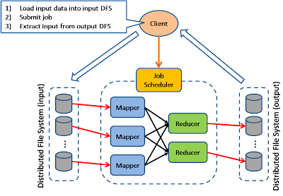

*<font color = red>Public servers of a scalable web serve are hidden behind a load balancer</font>*

<br>

**First golden rule for scalability:**
- Every server exactly contains the same codebase and does not store any user related-data, like sessions or profile pictures, on local dics or memory.  

**Second rule for Database :**
-  We can stay with MySQL, but use it like NoSQL database, or we can switch to a easier and better scale NoSQL database like MongoDB or CouchDB. 

**Third rule for cache:**
-  Let your Class assemble a dataset from your database and then store the complete instance of the Class or the assembled dataset in the cache.
-  some ideas of objects to cache:
   -  user sessions 
   -  fully rendered blog articals
   -  activity streams
   -  user<->friend relationships

**Fourth rule for Async:**
-  Do the time-consuming work in advance and serve the finished work with a low request time.
-  Handle tasks asynchronously.

## <font color=red>Performance vs Scalability</font> 
Sum: A serve is scalable if it reaults in increased performance in a manner proportional to resourses added.  

### Why is scalability so hard ?
-  Scalability cannot be after-thought, it requires applications and platforms to be designed with scalaing in mind.  
-  A second problem area is that growing a system through scale-out generally results in a system that has to come to terms with hereogeneity.
  

## <font color=red>Latency vs throughout</font>
*Latency* is the time to perform some action or to produce some result.
*Throughout* is the number of such actions or results per unit if time.  

## <font color=red>Availability vs consistency</font>
### CAP Theorem
-  Consistency - A read is guaranteed to return the most recent write for a given client.
-  Availability - A non-falling node will return reasonable response within a mount of reasonable time (no error or time out).
-  Partition Tolerance - The system will continue to function when network Partitions occur.
    -  CP - Consistency/Partition Tolerance - Waiting for a response from the partitioned node might result in a timeout error. CP is a good choice if your business needs require atomic reads and writes.
    -  AP - Availability/Partition Tolerance - Responses return the most readily available version of the data available on any node, which might not be the latest. Writes might take some time to propagate when the partition is resolved.

### Consistency patterns

#### Weak consistency
After a write, reads may or may not see it. A best effort approach is taken.

#### Eventual consistency
After a write, reads will eventually see it (tipycally within milliseconds). Data is replicated asynchronously.

#### Strong consistency
After a write, reads see it. Data is replicated synchronously.

### Availability patterns
There are two complementary patterns to support availability : **fail-over** and **replication**.

#### Fail-over
With active-passive fail-over, heartbeats are sent between the active and the passive server on standby. If the heartbeat is interrupted, the passive server takes over active's IP address and resumes serve.

#### Active-active
In active-active, both servers are managing traffic, spreading the load between them.

### Disadvantage(s): failover
-  Failover adds more hardware and additional complexity 
-  There is a potential for loss of data if the active system fails between any newly written data can be replicated to the passive.

### Replication
**Master-slave and master-master**  
This topic is further discussed in the Database section.

### Availability in numbers
Availibility is often qualified by uptime (or downtime) as a percentage of time the serve is available.

#### Availability in parall or in sequence
If a serve consists of multiple components prone to fail, the serve's allover availability depends on whether the components in parall or in sequence.

Overall availibility decreases when two components with availibility < 100% are in sequence.  

`Availibility (total) = availibility (Foo) * availibility (Bar)`

Overall availibility increases when two components with availibility < 100% are in parall.

`Availibility (total) = 1 - (1 - availibility (Foo)) * (1 - availibility (Bar))`

## <font color=red>Domain name system</font>  

A Domain Name System (DNS) translates a domain name such as www.example.com to an IP address.
- **NS record (name server)** - Specifies the DNS servers for your domain/subdomain.
- **MX record (mail exchange)** - Specifies the mail servers for accepting message.
- **A record (address)** - Points a name to an IP address.
- **CNAME (canonical)** - Points a name to another name or `CNAME` or to an `A` record.

**Some DNS systems can route traffic through various methods:**

-  Weighted round robin
   <details><summary><em>点击查看</em></summary>

   <br>

   -  **Round robin algorithm**  
  
      The round robin algorithm is best for clusters consisting of servers with identical specs. 

      

    - **Weighted round robin**  
      Assigin more requests to the server with a higher capability of handling greater load.
      
      

    - **Least connections**  
       When a new client attempts to connect, the load balancer will determine which server has the least number of connection and assign the new connection to that server.

       

    - **Weighted least connections**  
      The weighted least connections algorithm does to least connections what weighted round robin does to round robin.

    - **Random**  
      As its name implies, the algorithm matched clients and servers by random.

   </details>

-  Latency-based
-  Geolocation-based

**Disadvantage(s) : DNS**

-  Accessing a DNS server introduces a slight delay, although mitigated by caching described above.
-  DNS server management could be complex and is generally managed by governments, LSPs and large companys.
-  DNS server have recently come under DDoS attack, preventing users from accessing websites such as Twitter without knowing Twitter's IP address(es).
  

## <font color=red>Content delivery network</font>

A content delivery network (CDN) is a globally distributed network of proxy servers, serving content from locations closer to the user.

**Serving content from CDNs can significantly improve performance from two ways.**
- Users receive content from data centers close to them.
- Your Servers does not have to serve requests that the CDN fulfills.

**Push CDNs**
-  Push CDNs receive new content whenever chages occur on your server

**Pull CDNs**
-  Pull CDNs grap new content from your server when the first new user requests the content. You leave the content on your server and rewrite the URLs to point to the CDN.

**Disadvantage(s): CDN**
-  CDN costs could be significant depending on traffic, although this should be weighed with additional costs you would incur not using CDN.
-  Content might be stale if it is updated before thr TTL expires it.
-  CDNs require changing URLs for static content to point to CDN.

## <font color=red>Load balancer</font>

**Scatter and Gather**  
-  In this model, the dispatcher multicast to all workers of the pool.  
  

**Result Cache**  
In this model, the dispather will first lookup if the result has been made before and try to find the previous result to return, in order to save the actual execution.
  

**Shared Space**  
This model also known as "Blackboard", all workers monitor information from the shared space and contributes the partical knowledge back to the blackboard. The information is constinuously enriched until a solution is reached.
  

**Pipe and filter**  
This model is alsp known as 'Data Flow Programming', all workers connected by pipes where all data is flow across.
  

**Map Reduce**  
This model is targeting batch jobs where disk I/O is the major bottleneck. It use a distributed file system, so that the disk I/O can be done in parallel.
  

**Bulk Synchronous Parallel**  
This model is based on lock-step execution across all workers. coordinated by a master. Each worker repeat the following step until the exit condition is reached, when there is no more active workers.
-  Each worker read data from input queue
-  Each worker perform local processing base on the read data
-  Each worker push loacl result along its direct connection
  

**Execution Orchestrator**  
This model is based on intelligent scheduler / orchestrator to schedule ready-to-run task (based on a dependency graph) across a clusters of dumb workers
  

**summary:** Load balancers distribute incoming client requests to computing resources such as application servers and databases. Load balancers are effective at:
-  Preventing request from going to unhealthy servers
-  Preventing overloading resources
-  Helping to eliminate a single point of failure
  
Additional benefits include:
- SSL termination: Decrypt incoming requests and Encrypt server response so backend servers do not have to perform these potential expensive operations
- Session persistence: Issue cookies and route a specific client's requests to same instance if the web apps do not keep track of sessions

### Horizontal scaling
**Disadvantage(s): horizontal scaling**
-  Scaling horizontally introduce complexity and involves cloning servers
   -  Servers should be stateless: they should not contain any user-related data like sessions and profile pictures
   -  Sessions can be stored in centralized data store like such as a database or persistent cache.
-   Download servers such as caches and databases need to handle more simultaneous connections as upstream servers scale out.

**Disadvantages load balancer**
-  The load balancer can become a bottleneck if it doesn't have enough resource or it is not configured properly.
-  Introducing a load balancer to help eliminate a single point of failure results in increased complexity.
-  A single load balancer is a single point of failure, configuring multiple load balancers further increases complexity.

## <font color=red>Reverse Proxy (web server)</font>
**Summary:** A reverse proxy is a web server that centralizes internel services and provide unified interfaces to the public.  

**Additional benefits include**:
-  Increased security: Hide information about backend servers, blacklist IPs, list number of connections per client.
-  Increased scalability and flexibility: Client only see proxy's IP, allowing you to scale servers or change their configuration.
-  SSL terminal: Decrypt incoming requests and encrypt server responses so backend servers do not have to perform these potentially expensive operations.
-  Compression: compress server response
-  Caching: return the response for cached requests
-  Static content: Serve static content directly  

**Load balancer** vs **Reverse proxy**
-  Deploying a load balancer is useful when you have multiple servers. Often, load balancer route traffic to a set of servers serving the same function.
-  Reverse proxies can be useful even with just one web server or application server. opening up the benefits described in the previous section.
-  Solutions such as NGINX and HAProxy can support both layer 7 reverse proxying and load balancing.

**Disadvantages(s): reserve proxy**
- Introducing reserve proxy results in increased complexity
- A single reverse proxy is a single point of failure, configuring multiple reverse proxies (ie a failover) further increases complexity.

## <font color=red>Application layer</font>
A moderately large system may balance load at three layers:
- user to your web servers
- web servers to an internal platform layer,
- internal platform layer to your database.

There are a number of ways to implement load balancing.  

### Smart clients
What is a smart clients ? It's a client which takes a pool of service hosts and balaces load between them, detects downed hosts and avoids sending requests their way(they also have to detect recovered hosts, deal with adding new hosts).

### Software load balancers
HAProxy is a great example of this approach. HAProxy manages healthchecks and will remove and return machines to those pools according to configuration, as well as balancing all the machines in those pools as well.

### Caching
Caching will enable you to make vastly better use of the resources you already have, as well as making otherwise unattainable product requirements feasible.

Caching consists of: precalculating results, pre-generating expensive indexes and storing cpoies of frequently accessed data in a faster backend.

In practice, caching is important earlier in development process than load balancing, and starting with a consisent caching will save you time later on.

#### Application vs. database caching
Application caching requires explicit integration in the application code itself. Usually it will check if a value is in the cache, if not , retrieve the value from the database; then write that value into the cache. The code typically looks like :  
```
key = "user.%s" % user_id
user_blob = memcache.get(key)
if user_blob is None:
   user = mysql.query("SELECT * FROM users WHERE user_id=\"%s\"", user_id)
   if user:
      memcache.set(key,json.dumps(user))
    return user
else:
    return json.loads(user_blob)
```
When you flip your database on, you're going to get some level of default configuration which will provide some degree of caching and performance.Those initial setting will optimized for a generic usecase, and by tweaking them to your system's access patterns, you can generally squeeze a great deal of performance improvment.

#### In-memory caches
