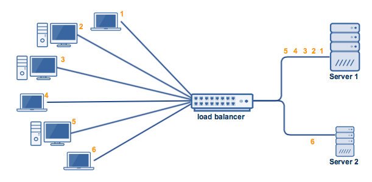

*Public servers of a scalable web serve are hidden behind a load balancer*

 

**First golden rule for scalability:**
- Every server exactly contains the same codebase and does not store any user related-data, like sessions or profile pictures, on local dics or memory.  

**Second rule for Database :**
-  We can stay with MySQL, but use it like NoSQL database, or we can switch to a easier and better scale NoSQL database like MongoDB or CouchDB. 

**Third rule for cache:**
-  Let your Class assemble a dataset from your database and then store the complete instance of the Class or the assembled dataset in the cache.
-  some ideas of objects to cache:
   -  user sessions 
   -  fully rendered blog articals
   -  activity streams
   -  user<->friend relationships

**Fourth rule for Async:**
-  Do the time-consuming work in advance and serve the finished work with a low request time.
-  Handle tasks asynchronously.

## Performance vs Scalability 
Sum: A serve is scalable if it reaults in increased performance in a manner proportional to resourses added.  

### Why is scalability so hard ?
-  Scalability cannot be after-thought, it requires applications and platforms to be designed with scalaing in mind.  
-  A second problem area is that growing a system through scale-out generally results in a system that has to come to terms with hereogeneity.
  

## Latency vs throughout
*Latency* is the time to perform some action or to produce some result.
*Throughout* is the number of such actions or results per unit if time.  

## Availability vs consistency
### CAP Theorem
-  Consistency - A read is guaranteed to return the most recent write for a given client.
-  Availability - A non-falling node will return reasonable response within a mount of reasonable time (no error or time out).
-  Partition Tolerance - The system will continue to function when network Partitions occur.
    -  CP - Consistency/Partition Tolerance - Waiting for a response from the partitioned node might result in a timeout error. CP is a good choice if your business needs require atomic reads and writes.
    -  AP - Availability/Partition Tolerance - Responses return the most readily available version of the data available on any node, which might not be the latest. Writes might take some time to propagate when the partition is resolved.

### Consistency patterns

#### Weak consistency
After a write, reads may or may not see it. A best effort approach is taken.

#### Eventual consistency
After a write, reads will eventually see it (tipycally within milliseconds). Data is replicated asynchronously.

#### Strong consistency
After a write, reads see it. Data is replicated synchronously.

### Availability patterns
There are two complementary patterns to support availability : **fail-over** and **replication**.

#### Fail-over
With active-passive fail-over, heartbeats are sent between the active and the passive server on standby. If the heartbeat is interrupted, the passive server takes over active's IP address and resumes serve.

#### Active-active
In active-active, both servers are managing traffic, spreading the load between them.

### Disadvantage(s): failover
-  Failover adds more hardware and additional complexity 
-  There is a potential for loss of data if the active system fails between any newly written data can be replicated to the passive.

### Replication
**Master-slave and master-master**  
This topic is further discussed in the Database section.

### Availability in numbers
Availibility is often qualified by uptime (or downtime) as a percentage of time the serve is available.

#### Availability in parall or in sequence
If a serve consists of multiple components prone to fail, the serve's allover availability depends on whether the components in parall or in sequence.

Overall availibility decreases when two components with availibility < 100% are in sequence.  

`Availibility (total) = availibility (Foo) * availibility (Bar)`

Overall availibility increases when two components with availibility < 100% are in parall.

`Availibility (total) = 1 - (1 - availibility (Foo)) * (1 - availibility (Bar))`

## Domain name system  

A Domain Name System (DNS) translates a domain name such as www.example.com to an IP address.
- **NS record (name server)** - Specifies the DNS servers for your domain/subdomain.
- **MX record (mail exchange)** - Specifies the mail servers for accepting message.
- **A record (address)** - Points a name to an IP address.
- **CNAME (canonical)** - Points a name to another name or `CNAME` or to an `A` record.

**Some DNS systems can route traffic through various methods:**

-  Weighted round robin
   

<em>点击查看</em>

    

   -  **Round robin algorithm**  
  
      The round robin algorithm is best for clusters consisting of servers with identical specs. 

      

    - **Weighted round robin**  
      Assigin more requests to the server with a higher capability of handling greater load.
      
      

    - **Least connections**  
       When a new client attempts to connect, the load balancer will determine which server has the least number of connection and assign the new connection to that server.

       

    - **Weighted least connections**  
      The weighted least connections algorithm does to least connections what weighted round robin does to round robin.

    - **Random**  
      As its name implies, the algorithm matched clients and servers by random.

   

-  Latency-based
-  Geolocation-based

**Disadvantage(s) : DNS**

-  Accessing a DNS server introduces a slight delay, although mitigated by caching described above.
-  DNS server management could be complex and is generally managed by governments, LSPs and large companys.
-  DNS server have recently come under DDoS attack, preventing users from accessing websites such as Twitter without knowing Twitter's IP address(es).
  

## Content delivery network

A content delivery network (CDN) is a globally distributed network of proxy servers, serving content from locations closer to the user.

**Serving content from CDNs can significantly improve performance from two ways.**
- Users receive content from data centers close to them.
- Your Servers does not have to serve requests that the CDN fulfills.

**Push CDNs**
-  Push CDNs receive new content whenever chages occur on your server

**Pull CDNs**
-  Pull CDNs grap new content from your server when the first new user requests the content. You leave the content on your server and rewrite the URLs to point to the CDN.

**Disadvantage(s): CDN**
-  CDN costs could be significant depending on traffic, although this should be weighed with additional costs you would incur not using CDN.
-  Content might be stale if it is updated before thr TTL expires it.
-  CDNs require changing URLs for static content to point to CDN.

## Load balancer

**Scatter and Gather**  
-  In this model, the dispatcher multicast to all workers of the pool.  
  

**Result Cache**